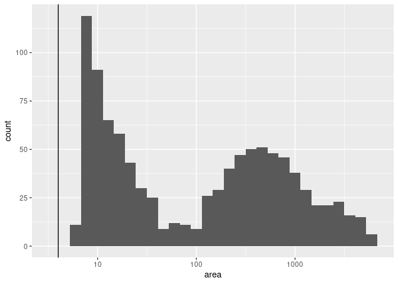

<!-- README.md is generated from README.Rmd. Please edit that file -->

# realsat-r

## Dataset Summary

ReaLSAT-R-2.0 provides surface area variations of 15473 reservoirs
created after 1984 (detected using satellite imagery analysis, see
[paper](http://umnlcc.cs.umn.edu/realsat/reservoirs/data/ReaLSAT-R-2.0.pdf)).
In addition, it also provides area variations of 3274 reservoirs created
before 1984 (taken from a widely used GRanD database.)

  - 853 reservoirs in ReaLSAT-R-2.0 that are also reported in GRanD
    dataset.

  - 14620 reservoirs in ReaLSAT-R-2.0 that are not available in GRanD.

  - 3274 reservoirs created before 1984 (taken from GRanD)

## Exploration

``` r
library(sf)
#> Linking to GEOS 3.8.0, GDAL 3.0.4, PROJ 6.3.1
library(LAGOSNE)
suppressMessages(library(dplyr))
library(ggplot2)

dt <- read_sf("data/ReaLSAT-R-2.0.shp")

dt_lagosne <- dt %>%
  st_intersects(st_zm(LAGOSNE::lg_extent)) %>%
  lapply(., function(x) length(x)) %>%
  unlist() %>%
  sapply(function(x) x!=0)
#> although coordinates are longitude/latitude, st_intersects assumes that they are planar
dt_lagosne <- dt[dt_lagosne,]

ggplot() +
  geom_sf(data = st_zm(LAGOSNE::lg_extent)) +
  geom_sf(data = dt_lagosne)
```

<!-- -->

``` r

dt_lagosne_areas <- dt_lagosne %>%
  st_area() %>%
  units::set_units("ha") %>%
  as.numeric() %>%
  data.frame(area = .)

ggplot(data = dt_lagosne_areas, aes(area)) +
  geom_histogram() +
  scale_x_log10() +
  geom_vline(aes(xintercept = 4))
#> `stat_bin()` using `bins = 30`. Pick better value with `binwidth`.
```

<!-- -->

## Links

<http://umnlcc.cs.umn.edu/realsat/reservoirs/>

<http://umnlcc.cs.umn.edu/realsat/reservoirs/data/ReaLSAT-R-2.0.html>
