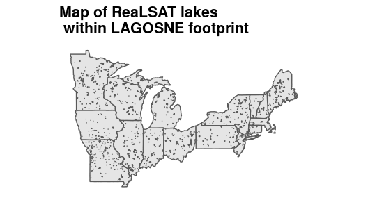
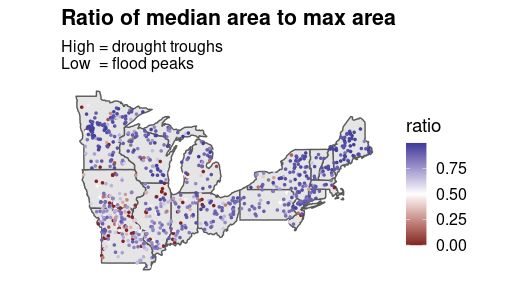
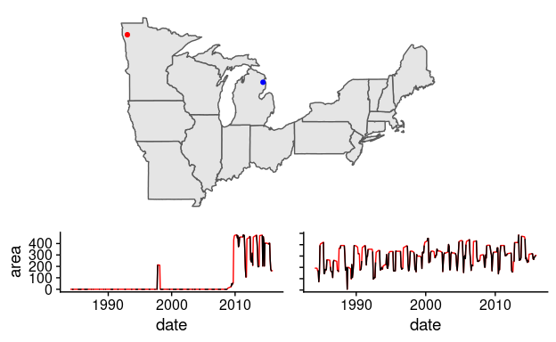

<!-- README.md is generated from README.Rmd. Please edit that file -->

# realsat-r

## Dataset Summary

ReaLSAT-R-2.0 provides surface area variations of 15473 reservoirs
created after 1984 (detected using satellite imagery analysis, see
[paper](http://umnlcc.cs.umn.edu/realsat/reservoirs/data/ReaLSAT-R-2.0.pdf)).
In addition, it also provides area variations of 3274 reservoirs created
before 1984 (taken from a widely used GRanD database.)

## Exploration

-----

-----

## Links

<http://umnlcc.cs.umn.edu/realsat/reservoirs/>

<http://umnlcc.cs.umn.edu/realsat/reservoirs/data/ReaLSAT-R-2.0.html>
